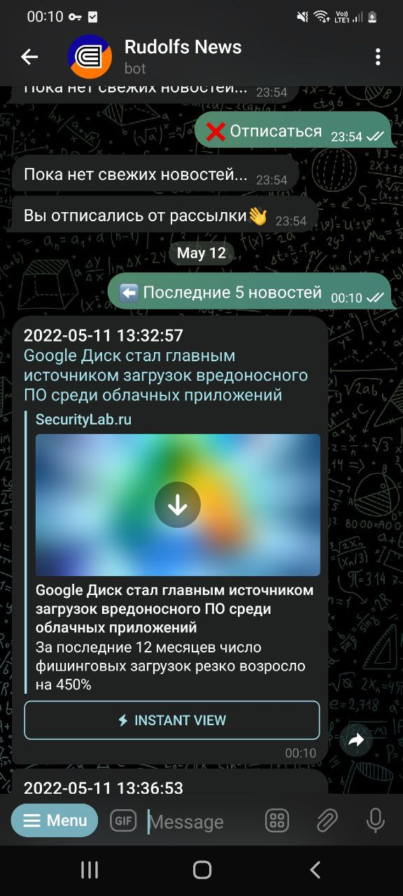

--------


-----------


 Телеграм Бот на Python
===
️

----

*__Что делает бот?__*
===========

----
```
🟢Rudolfs News, чтобы вы оставались в курсе событий в мире технологий 
```

🔗[Ссылка на бота](http://t.me/Roudolfs_bot)

---
1. 🔐 Бот имеет привязку к каналу, некоторые функции доступны только подписчикам канала
---
2. 📰 Бот парсит новости со следующего [сайта](https://www.securitylab.ru/)
----

3. 🔴 Пример работы бота от обычного пользователя


-----

------

4. 🟢 Пример работы от подписчика канала

------------
5. **Для запуска бота локально!!**
```
в терминале надо написать 

python run.py

или
 
python3 run.py

в зависимости от версии python на вашем пк

далее введите данные бота, канала и базы данных, с которыми хотите работать.
```
-----
⚠️**Убедитесь, что в вашей таблице базы данных есть следующие поля**
1. *id - типа int, с параметром primary_key*
2. *user_id - типа bigint, not null*
3. *status - типа boolean, not null, с дефолтным значением True*
---
📱 Сообщите мне о любых неполадках у бота 

 [here](https://t.me/Roudolf)
